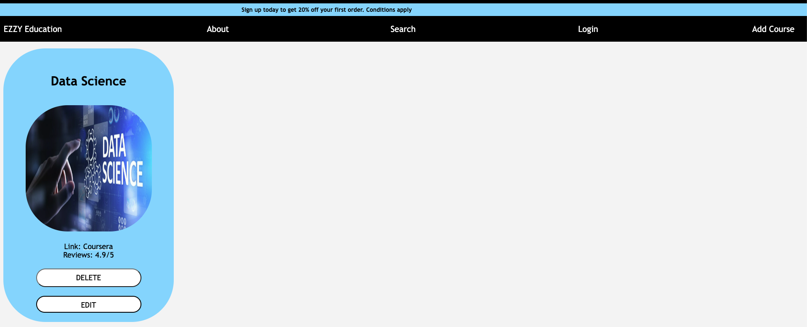
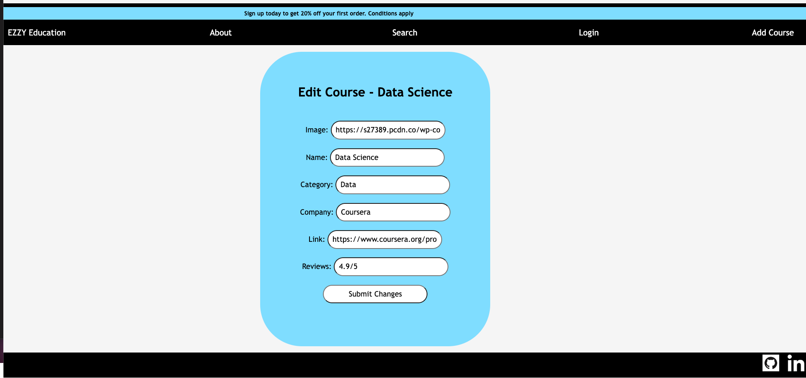
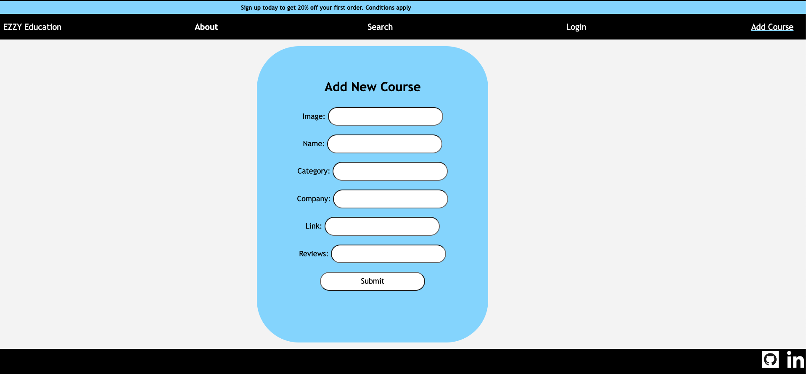

### EZZY ED an e-learning application

### Screenshots from APP

### Technologies Used
#### Javascript, HTML, CSS, Trello

### Getting Started
#### Link:https://ezzy-learning-app.herokuapp.com/courses
####

### Next Steps
#### Add a Login/Signup form 
#### Add a working search bar

#### 